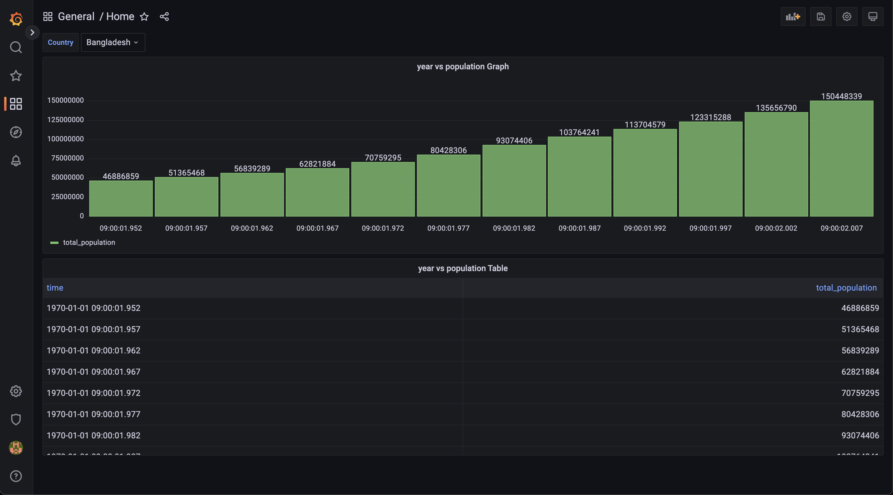

# Sample Graphana Example using Python and PostgreSQL


## Installation
```bash
docker-compose up 
```

## DB Preparation
Create Table Using Below Qeury
```bash
CREATE TABLE sample (
  id serial PRIMARY KEY,
  country text,
  year numeric,
  pop numeric,
  continent text,
  lifeExp float,
  gdpPercap float
);
```

## Graphana

1. Go to http://localhost:3000/

2. Login using
    - Username: `admin`
    - Password: `admin`

3. Connect DB
    - Settings >  Data Sources > Postgresql
    - Host: `host.docker.internal:5432`
    - Database: `graphana_db`
    - User: `admin`


Graphana Sample: 


    